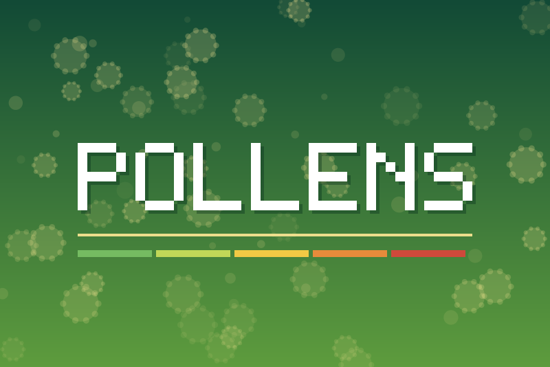

# Pollens — Gladys Assistant integration



External integration for [Gladys Assistant](https://gladysassistant.com)
exposing the **pollen risk** of the locations you choose: one device per
location, with a 0-to-5 risk level per pollen species.

Built from the official
[JavaScript integration template](https://github.com/GladysAssistant/integration-template-js).

**No account, no API key.** The user adds their Gladys houses in one click, or
types a town, and gets a device.

- 🇫🇷 [User documentation (français)](./docs/fr.md)
- 🇬🇧 [User documentation (English)](./docs/en.md)

## Data sources

| Need                  | Source                                                                                                                                   | Auth |
| --------------------- | ---------------------------------------------------------------------------------------------------------------------------------------- | ---- |
| Pollen concentrations | [CAMS European air quality forecast](https://atmosphere.copernicus.eu/) via [Open-Meteo](https://open-meteo.com/en/docs/air-quality-api) | none |
| Town → position       | [Open-Meteo geocoding API](https://open-meteo.com/en/docs/geocoding-api) (GeoNames)                                                      | none |

CAMS is the atmospheric service of the EU Copernicus programme, operated by
ECMWF: an official source, on a ~11 km grid, forecasting the six main allergenic
taxa (alder, birch, grass, mugwort, olive, ragweed) in grains/m³.

### Why not Atmo France

[Atmo France](https://www.atmo-france.org/) publishes a French pollen index, but
its API requires an account and an authentication token. Every user would have
to create one before the integration did anything at all. CAMS gives official
data with zero setup, so it wins. Should Atmo France open an unauthenticated
endpoint later, it slots in as an extra provider (see below) without touching
the device code.

## How it works

Locations are **not** `config_schema` fields — a list the user builds at runtime
cannot be one: the Configuration screen is generated from a static manifest, and
every field it renders that is not a `section` is an `<input>`. They are managed
by five buttons and stored by the integration itself through
`gladys.setConfig({ locations })`, the documented way to keep integration-owned
state outside the schema.

| Action                       | What it does                                                          |
| ---------------------------- | --------------------------------------------------------------------- |
| **Add a location**           | Geocodes a town (or takes a point), stores it, re-publishes Discovery |
| **Add my Gladys houses**     | Turns the houses configured in Gladys into locations, in one click    |
| **Show my locations**        | The numbered listing — those numbers are what the delete picker takes |
| **Test the pollen provider** | Live call to the source, for _every_ location                         |
| **Remove a location**        | Drops the location it names, so it leaves the Discovery tab           |

`publishDiscoveredDevices()` replaces the previously published list, so adding a
location makes it appear in the **Discovery** tab and removing one makes it
disappear. Creating and deleting the actual Gladys device stays the user's call,
as for every integration.

Most place names are shared: `Montauban` exists twice in France alone. Rather
than guessing, `add_location` lists the candidates and asks for a comma and the
region, the country or the postal code — `Montauban, Tarn-et-Garonne`.

### The Gladys houses, read once

`import_houses` reads the houses the user already placed on the map in Gladys
(`GET /house`, opened by Gladys 4.85.0) and adds a location for each one that is
not watched yet. That is a permission, not just an endpoint: the manifest
declares `"location": true`, the install screen shows the request, and the core
answers 403 to an integration that did not ask — which is also why
`gladys_version` is `>=4.85.0`, and why `src/houses.js` tells that status apart
from every other failure (only a re-install grants it, no retry ever will).

The SDK does not wrap the endpoint yet (0.11.0), so the call is made by hand with
the two environment variables the SDK itself reads.

It is a read, not a sync: the houses are fetched at the click, and what comes out
is an ordinary location. A house with no position on the map, or one outside the
CAMS domain, is named in the answer rather than silently skipped, and the whole
import is **one** `setConfig` and **one** re-publish.

### Two Gladys core constraints this integration is shaped by

Both were learned the hard way, and both silently emptied the Discovery tab:

- **`poll_frequency` is an enum in milliseconds capped at one minute.** Any other
  value has the _whole_ device batch refused. A pollen forecast changes once a
  day, so the devices declare none and the integration runs its own
  `setInterval` (`startPolling`), floored at `MIN_REFRESH_SECONDS`.
- **Every feature needs an explicit numeric `min` and `max`** —
  `t_device_feature.min/max` are `NOT NULL` with no default, text features
  included.

A refused batch is now logged, and reported in the Supervision screen through
`setConnectionStatus`, instead of leaving an empty tab with no explanation.

## Device features

Eight features per location, all read-only and historized:

- **Overall pollen risk** (0-5) — the worst of the six taxa;
- **Dominant pollen** (text) — which taxon drives that risk;
- one risk (0-5) per taxon: alder, birch, grass, mugwort, olive, ragweed.

Concentrations are graded with **per-species thresholds** (`src/pollen/risk.js`):
30 grains/m³ is a quiet day for birch and a heavy one for ragweed. A taxon the
model has no value for publishes nothing at all — a missing measurement is not a
zero risk.

### Names are the one thing Gladys cannot translate

Every message this integration displays travels as an `{ en, fr }` object and is
rendered by the core in the language of the user reading it. A device name and a
feature name are not messages: they are plain strings copied into the core tables
the day the user creates the device, and the host API never tells an integration
which language its user reads — the only language it exposes anywhere is that of
a messaging contact (`getContacts()`, contract B.15), which this integration has
none of.

So the language of the names is a config field (`src/language.js`), **French by
default**, and it is the only place in the code that picks a language instead of
handing Gladys both. It also drives the two TEXT states, which are stored strings
just like a name. Re-publishing renames nothing: the core upserts the params of
an existing device, never its name, so a switch applies to the devices still to
be created.

## Project structure

```
.
├─ index.js                          # SDK bootstrap + event wiring (no pollen logic)
├─ src/
│  ├─ config.js                      # config defaults + normalization
│  ├─ language.js                    # the language of the NAMES (the only untranslated text)
│  ├─ locations.js                   # the location list: normalize / upsert / remove / print
│  ├─ locationEditor.js              # the four location actions of the Configuration screen
│  ├─ houses.js                      #   the user's Gladys houses (GET /house)
│  ├─ geocoding.js                   # ← town -> coordinates (Open-Meteo geocoding)
│  ├─ coordinates.js                 #   parsing a WGS-84 coordinate typed by a human
│  ├─ richText.js                    #   the only emphasis an action message can carry
│  ├─ pollen/                        # ← the pollen data sources
│  │  ├─ index.js                    #   provider registry + grading
│  │  ├─ openMeteo.js                #   Open-Meteo / CAMS Europe driver
│  │  └─ risk.js                     #   grains/m³ -> 0-5 risk, per species
│  └─ devices/
│     ├─ index.js                    #   devices = a projection of the locations
│     └─ pollenStation.js            #   the device type (features, poll, states)
├─ docs/{en,fr}.md                   # user documentation, re-hosted by Gladys
├─ test/                             # node --test, no network
├─ gladys-assistant-integration.json # manifest
└─ cover.png                         # catalog cover, 800×534
```

## There is no country to configure

Everything downstream of the geocoder — the provider, the devices, the features
— works on a latitude and a longitude. The country only ever existed as the
registry that knew how to read a national postal code, which made the
integration French while its data is European. One worldwide geocoder removed
that step: no country field, no registry to extend, no manifest option list to
keep in sync. Coverage is decided by the provider instead — `supports()` — and a
point outside it is refused when the location is added, rather than published as
a device that never holds a value.

## Adding a pollen source

1. create `src/pollen/<yourProvider>.js` exposing `{ key, name, taxa,
supports(location), fetchPollen(location) }`;
2. append it to `PROVIDERS` (`src/pollen/index.js`), **before** the more generic
   ones — the first provider that supports the location wins, so a national
   source overrides the continental fallback for its own country.

The device code never names a provider: it asks the registry.

## Development

```bash
npm install
npm test          # node --test, network-free (fetch is stubbed)
npm run lint
npm run format
```

## Releasing

The workflows come from the official template and are repo-generic:

1. add the GitHub topic `gladys-assistant-integration` to the repository;
2. run the **Release** workflow — it bumps the version, tags it, and builds the
   multi-arch image to `ghcr.io/prohand/gladys-pollen`.

## Licence

Apache-2.0.

Pollen data © Copernicus Atmosphere Monitoring Service (CAMS), served by
Open-Meteo. Place names © GeoNames, served by Open-Meteo.
